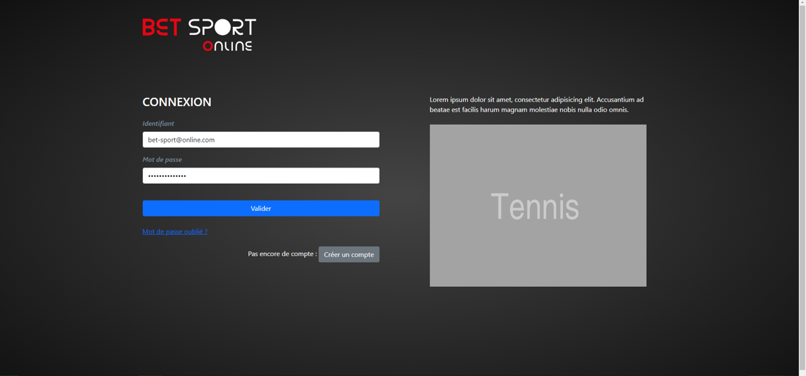

# parisportif2 - Online Bet Sport
# 
## Target : Design App for online bet, with several sport available, pokerstars like 

---
Specifications : https://github.com/OFP-CDA-Mulhouse-2020/specs

Logbook : https://github.com/OFP-CDA-Mulhouse-2020/parisportif2/blob/develop/document/activity.md

Tools : 

---
## Development Workflow :

### Phase 1 : Design graph and logic, from 03-11-2020 to  16-11-2020

### Phase 2 : Initialization of the project and Entity creation with TDD from 16-11-2020 to 23-12-2020

### Phase 3 : Development of App with Functional test from 04-01-2021 to 26-02-2021

### Phase 4 : Finalization with security and caching part from 01-03-2021 to 01-04-2021

---
## Overview :

### Login Page

### Home Page

### When you select a Bet

### When you deselect a Bet

### Admin Part

